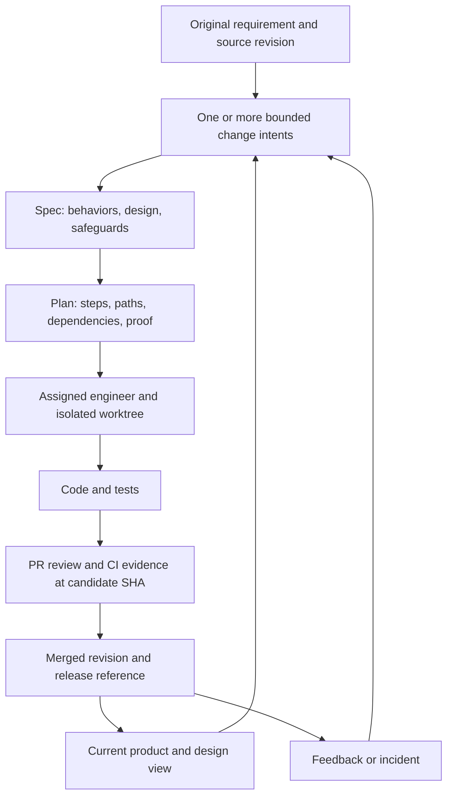

# Governable changes across teams and sprints

Research and proposed improvement plan, 8 September 2026. Repository inspected at `6014fb43e2ae15681520892e1e5af2df5f4add9a`. This is a proposal, not implementation approval. Existing approved artifacts remain unchanged.

**Recommendation.** Keep the harness's per-change `intent.md → spec.md → plan.md → code/tests → review` chain. Strengthen its design content using REASONS, connect changes to durable product requirements, and replace repository-wide execution selection with an explicit change per worktree. Use existing issue tracking and Git hosting for team allocation and authoritative review. Evolve the code graph into a navigation aid connected to a small, verifiable delivery index. Avoid adding a second specification framework or a scheduling service.

The repository already has substantial sequential-delivery machinery. Its main shortfall is the distinction between a shared backlog, the change a particular engineer is executing, and the requirements actually implemented on a particular revision. Those are currently conflated in several places.

**What SPDD contributes.** SPDD treats the reviewed structured prompt as a maintained delivery artifact. Its example moves from requirements through code-grounded analysis and design into generation, verification and review. A requirement correction updates the prompt before code; a behavior-preserving refactor can update code first and synchronize the design afterward. The walkthrough changes an existing billing engine through targeted diffs. It also produces a separate testing prompt: a structured prompt is not necessarily identical to a user story. “Prompts as First-Class Delivery Artifacts” is the caption/concept in the linked article, rather than a separate publication identified by this review. [SPDD article](https://martinfowler.com/articles/structured-prompt-driven/)

The optional story command decomposes larger requirements into independent deliverable stories with business acceptance criteria. Consequently, multiple bounded prompts in an iteration is a sound interpretation; “one sprint = one prompt” is not the model. Nor is there a mandatory one-to-one relationship between stories and prompts. A story can need analysis, an implementation Canvas, and a testing prompt. [OpenSPDD story template, article-linked version](https://github.com/gszhangwei/open-spdd/blob/v0.4.9/internal/templates/data/optional/spdd-story.md)

REASONS covers Requirements, Entities, Approach, Structure, Operations, Norms and Safeguards. The implementation template reads relevant existing code and favors preserving suitable structures over unnecessary abstraction. It provides a feature-level design and task breakdown, not a mandate to redesign the entire repository for every change. [REASONS template](https://github.com/gszhangwei/open-spdd/blob/v0.4.9/internal/templates/data/core/spdd-reasons-canvas.md)

| Dimension | Proposed home in this harness | Content worth retaining |
|---|---|---|
| Requirements | `intent.md`, then `spec.md` behaviors | Original source, desired outcome, acceptance criteria |
| Entities | `spec.md` Design, when relevant | Domain terms, state and relationships |
| Approach | `plan.md` Approach; consequential decisions in spec | Chosen approach and meaningful tradeoffs |
| Structure | `spec.md` Design; `plan.md` Files | Boundaries, interfaces, dependency changes |
| Operations | `plan.md` Order | Small ordered implementation steps and dependencies |
| Norms | Referenced project instructions and policies | Applicable conventions and their revisions |
| Safeguards | `spec.md` Safeguards and plan proof | Compatibility, security, operational invariants |

This mapping is our proposed adaptation. It does not require `reasons.md` beside the same information in spec and plan. Private method signatures usually belong in code; include signatures in the design when another team depends on the contract.

OpenSPDD's sync command compares implementation against a selected Canvas, proposes updates for review, then checks consistency. It is an agent instruction template, not a deterministic semantic equivalence checker. It can propose updates to behavioral and safeguard details, so adopting it blindly could turn an implementation defect into the new specification. Our adaptation should distinguish an authorized requirement change from an implementation mismatch before accepting synchronization. [OpenSPDD sync template](https://github.com/gszhangwei/open-spdd/blob/v0.4.9/internal/templates/data/core/spdd-sync.md)

**What Anthropic means by intent.** The article's Stage 1 is named Plan: it produces `intent.md`, a proto-spec of what is wanted and why. Stage 2 Design produces `spec.md`; the implementation planning step inside Stage 3 Build produces `plan.md`. It explicitly discusses multiple intent files and a shared intent directory. It also recommends separate worktrees for independent tasks and sequential handling of tasks sharing files. It does not prescribe a sprint hierarchy or a team assignment protocol. Thus a collection of intents is supported; a parent/child dependency model is our extension. It accommodates existing systems of record rather than requiring everything to move into Markdown. [Anthropic SDLC playbook](https://claude.com/blog/the-ai-native-sdlc-playbook)

For this harness, an intent should represent a coherent outcome with its own acceptance decision. An implementation task such as “add a DTO” normally belongs inside its plan. A large initiative may have several child intents when those outcomes have distinct owners, acceptance decisions or delivery dates. A sprint selects work from that collection; moving work to another sprint must not change its identity.

**What to learn from Devin and spec-kit.** These are documented capabilities, not independently measured effectiveness or proof that Devin is the market leader.

| Reference | Documented approach | Adaptation worth considering |
|---|---|---|
| Devin managed sessions | Decomposition into managed sessions with isolated VMs; coordinator monitors work and resolves conflicts | Explicit work packages, isolation and human accountability; no need to reproduce its coordinator in the harness |
| Devin knowledge and playbooks | Reusable instructions and learning from successful and failed sessions | Curate patterns that have demonstrated value, retaining applicability and source evidence |
| Devin DeepWiki | Repository documentation, architecture diagrams and source links | Readable context grounded in code, with clear freshness and coverage |
| Devin stacked PRs | Large work split into ordered reviewable PRs with per-layer CI | Distinguish parallel changes from dependent changes; plan integration order |
| spec-kit | Feature specs, implementation plans and story-associated tasks with dependency/parallel markers | Stable identities, explicit dependencies, small independently testable slices |

Devin's managed sessions provide VM isolation and coordination; its playbook workflow can turn session experience into reusable procedures. These features do not establish a requirement-to-code proof by themselves. [Managed sessions and learning](https://docs.devin.ai/work-with-devin/advanced-capabilities), [playbooks](https://docs.devin.ai/product-guides/creating-playbooks)

DeepWiki offers code-linked repository documentation and architecture views. This is a useful reference for the human-facing context experience, but generated documentation still requires validation against the revision being changed. [DeepWiki](https://docs.devin.ai/work-with-devin/deepwiki)

Devin documents ordered PR stacks and continued handling of conflicts and CI across their layers. That is a separate coordination problem from starting independent tasks simultaneously. [Stacked PRs](https://docs.devin.ai/work-with-devin/stacked-prs)

Devin also documents centrally managed security profiles, including mandatory restrictions that subordinate settings cannot relax. Our analogous enforcement should come from the organization's existing sandbox, credentials and Git hosting, rather than a new local permission framework. [Security profiles](https://docs.devin.ai/product-guides/security-profiles)

Spec-kit's task template associates task IDs with user stories, marks independent work `[P]`, and names dependencies and paths. Its plan template includes research, data model, contracts and other supporting artifacts. That is more machinery than this harness needs to adopt wholesale. [Task template](https://github.com/github/spec-kit/blob/main/templates/tasks-template.md), [plan template](https://github.com/github/spec-kit/blob/main/templates/plan-template.md)

However, calling spec-kit inherently incapable of lean or iterative work would be inaccurate. Its current guidance distinguishes historical feature records, living specifications and flows that reconcile implementation discoveries back into artifacts. It explicitly addresses existing projects. Borrow those persistence distinctions; retain this harness's simpler runtime and existing three delivery gates. [Evolving specs](https://github.com/github/spec-kit/blob/main/docs/guides/evolving-specs.md)

**What is implemented, and where it stops.** The following findings come from implementation and tests, not just README claims. File links are relative to this report; function names are stable navigation anchors at the inspected revision.

| Capability | Implemented evidence | Remaining gap |
|---|---|---|
| Multiple changes | `create`, `slugs`, `state` in [artifacts.mjs](../.aidlc/lib/artifacts.mjs) | No parent requirement model, assignment or dependency readiness |
| Design and proof | [spec template](../.aidlc/templates/spec.md), [plan template](../.aidlc/templates/plan.md); numbered behaviors and proof rows | Source requirement is prose; no validated requirement → behavior → executed evidence chain |
| Revision checks | `approve`, `read`, `bodyDigest`; plans record `spec_digest` | No corresponding intent revision binding; body digest excludes semantic frontmatter such as `supersedes` |
| Scope enforcement | `governingPlans`, [guard](../.aidlc/lib/guard.mjs), [scope-drift](../.aidlc/checks/scope-drift.mjs) | One global current change per checkout; local working diff only |
| Cross-change evolution | `extendsLinks`, `supersedesLinks`, `supersededBy` | No delivery-aware effective product view; no dependency semantics |
| Brownfield discovery | [graph](../.aidlc/lib/graph.mjs), [refresh](../.aidlc/lib/refresh.mjs), [pack](../.aidlc/lib/pack.mjs), [map](../.aidlc/lib/map.mjs) | Structural navigation only; no requirements, decisions, runtime/service contracts or ownership graph |
| Independent review | [review.mjs](../.aidlc/lib/review.mjs) archives explicit candidate and records base/candidate/model | Optional invocation; no automatic durable binding of every result to a merged delivery |
| Team distribution | Installer/shim in [CLI](../.aidlc/bin/harness); canonical instructions and plugin record | Runtime resolver accepts `HARNESS_HOME` and fallback cache versions without verifying the recorded commit |
| Operational feedback | [ledger](../.aidlc/lib/ledger.mjs), [maintenance example](../examples/maintain/band-to-intent.mjs) | Local ignored ledger is not a shared delivery audit; example is not a production incident integration |
| Product evaluation | [saved product evidence](../evals/evidence/product-summary.json), [comparison evidence](../evals/evidence/comparison-summary.json) | Sequential product campaigns; no demonstrated concurrent team campaign or general enterprise reliability |

Seven specific issues deserve priority:

1. **A backlog can stop unrelated development.** `draftsAwaitingGate` scans all open changes. A filled-in intent without its spec, a drafted spec, or stale approval can cause `governingPlans` to return no plan. Existing tests deliberately enforce this. A shared backlog with future intents therefore conflicts with the execution guard.
2. **The latest approval selects everyone's current change within that checkout.** `currentChange` chooses the most recent spec approval timestamp. Separate clones do not share live state, but importing newer planning artifacts can still switch the selected authority. Worktrees alone do not repair this selection rule.
3. **Local scope checking does not cover committed PR changes.** `scope-drift` examines `git diff --name-only HEAD` plus untracked files. An out-of-scope file fails before commit and passes after commit in a clean checkout. This was reproduced in a disposable product fixture. The main CI workflow runs tests and other jobs, but does not validate the actual PR's scope against an explicit base/candidate. Adding the existing scope command alone would still miss that diff.
4. **Relationships conflate continuity and relevance.** Spec approval requires `extends` or `supersedes` for every other open approved change, including unrelated work. The check validates presence, not semantic consistency. More open work means more irrelevant links. `extends` is not `depends_on`, and neither identifies a parent business outcome.
5. **Approval is confused with effective behavior.** `supersededBy` treats an approved spec as superseding another even before implementation or merge. `closed` also covers multiple meanings in practice. Product truth must be computed for a specified delivered revision; proposed changes must remain distinguishable.
6. **Local metadata cannot authenticate people.** The implementation correctly calls `--by` an audit label. Hooks are workflow guards, not a security sandbox. Adding identities to YAML will not produce separation of duties. Review authority must be verified through the host's protected review path. Bind semantic relationship metadata too, not just document bodies.
7. **Proof links are partly structural.** A proof row can be prose; a named file can exist without its claimed test running. The existing test-quality sensor openly counts test text rather than establishing assertion quality. Requirements coverage needs executed evidence with revision identity, plus human assessment of whether it proves the behavior.

There is also an important positive: the graph detects content/path changes, including shell edits and branch switches. Do not propose rebuilding this from scratch. Its extraction is line-oriented, call edges are heuristic, and current refresh performs a full rebuild when needed. Enterprise-scale latency and languages outside the extractor's coverage remain unproven. [Graph implementation](../.aidlc/lib/graph.mjs), [refresh implementation](../.aidlc/lib/refresh.mjs)

**Proposed information model.** Keep durable business identity separate from timeboxes and execution.



The sprint is a filtered view of selected intents. A parent initiative stays in the existing requirements tool or a concise source document. Child intents reference its stable ID and relevant acceptance criteria. Do not copy the whole parent into every child. If decomposition exposes a missing acceptance criterion, report the gap rather than marking the parent complete because all currently listed children finished.

Use the existing artifact slug as the repository-local change ID; qualify it with repository identity for cross-repository references. Keep `<change>#B<n>` stable. Introduce only necessary relationship fields:

| Field/concept | Meaning | Authority |
|---|---|---|
| `source` and source revision | Original requirement/ticket and the version interpreted | Existing requirements system, or versioned repo document |
| `parent` / parent criteria | Outcome this change contributes to | Intent references source; no duplicate parent registry |
| `depends_on` | Delivery prerequisite, including required interface revision | Plan or change metadata, reviewed with plan |
| `supersedes` | Specific behavior intentionally replaced | Spec, including relationship fields in revision binding |
| Assignee and iteration | Who is accountable and when scheduled | Existing issue tracker; displayed as a projection |
| Active change | Which single approved scope this worktree executes | Worktree-local binding plus branch/PR reference |
| Delivery | PR, candidate/base, merge and release identity | Git host and CI evidence |

This is a schema proposal, not syntax supported by the current scalar frontmatter parser. Start with simple scalar references and explicit tables; avoid introducing a general YAML engine or silently accepting unsupported nested fields.

A useful trace answers both directions: “Which code and executed checks satisfy requirement R?” and “Which approved behavior explains this change to module M?” Begin with source criterion → behavior ID → proof row → test result → PR diff at commit SHA. Add symbol links where helpful, with file/commit fallbacks after renames. A requirement can touch many modules and a module can implement many requirements; do not invent a one-to-one function mapping.

**How team delivery should work.** Example proposal: an initiative adds partial invoice payments. A shared payment API/schema change belongs to one owner. A portal display and a reconciliation job can then belong to different engineers, consuming the same reviewed contract. They can develop against agreed fixtures in parallel, but their integrated result must still be tested together. A migration or shared invariant is an explicit prerequisite, not independence inferred from different filenames.

The team's planner prepares bounded outcomes with acceptance criteria, dependencies and likely component impact. A technical lead reviews shared interfaces and integration order. Assign each change in the existing issue tracker. Each engineer starts one change in an isolated worktree or clone; the harness resolves that identity explicitly and checks only its own draft/approval state for write authority. Engineers can read all other work without inheriting its permission to write.

Compare planned write scopes against the current shared PR/assignment view when planning or refreshing. An overlapping path should produce a specific coordination finding: split it into shared prerequisite work, serialize the changes, or agree an integration owner. Cross-file conflicts also need review: schemas, event semantics, units, state transitions, database migrations and shared test environments. Stale remote visibility must be disclosed, not reported as “no conflicts.”

At integration, update from the target branch, inspect changes to dependencies, run affected contract/regression tests, and validate the full candidate diff. A changed dependency triggers impact assessment; material behavior, interface or scope changes need renewed approval. A harmless rebase should not invalidate every human decision. Use the host's normal merge controls and rerun evidence after candidate changes. No global file-lock server is proposed.

**How existing codebases enter the loop.** Onboarding should establish evidence before approving implementation against the legacy system. Capturing a new request can happen immediately; accepting it for delivery requires sufficient understanding of the affected area. The graph should be attempted first as a normal onboarding action, while a supported, documented fallback avoids making an incomplete graph a permanent block.

1. Inventory repositories, components, languages, entry points, build/test commands, existing docs, owners and deployed interfaces. Record the inspected commit and inaccessible areas.
2. Build the existing graph/map for supported source. Record coverage and exclusions. Use targeted code search, manifests, existing API schemas and runtime evidence for gaps; do not assert whole-system completeness.
3. Run baseline checks and characterize the behavior that the first changes might break. Existing tests prove observed behavior, not automatically the intended requirement. Capture known failures explicitly so a newly introduced regression cannot be hidden behind an already failing suite.
4. Have maintainers confirm a concise system description, critical invariants and uncertain business rules. Label inferred design as inferred, with evidence and owner. Never manufacture historical approvals or original requirements from code.
5. For each new intent, retrieve relevant prior behaviors, architecture decisions, code and tests; add impact analysis to the ordinary spec/plan. Reuse existing patterns unless the change justifies departure.
6. After merge, refresh structural context and incorporate reviewed design changes. Over successive sprints the validated portion of the product model expands; untouched legacy areas remain explicitly unmodeled.

Our proposed “context graph” therefore has two connected parts: rebuildable structural facts from code, and versioned human-reviewed links from delivery artifacts. Begin with files/JSON generated on demand. A graph database, embeddings service or whole-codebase Canvas is not a prerequisite.

**Keeping design current without losing history.** Preserve delivered change records, and generate a current view for a requested revision from delivered changes and their supersession links. Keep reusable system-level decisions in the project's existing architecture documents or ADRs when they span changes. Do not continually rewrite all old prompts or dump all prior prompts into every session.

For a new business rule, create the new change, identify the old behavior it replaces, approve the new contract and then implement. For a refactor, preserve behavior tests and update affected design references in the new change and current architecture record. For an implementation bug, fix the code to meet the approved requirement; do not synchronize the bug into that requirement. Before merge, review any discrepancy between stated design and implementation, using the existing review gate.

Approval describes a proposed future state. Merge describes repository state. Deployment can activate behavior later through release or feature flags. A current-view query must name which of these it means. Git history supplies past versions, but a generated view must also resolve conflicting replacements, deleted links and canceled work rather than simply choosing the latest timestamp.

Reuse should promote a validated technique into existing project guidance, a template or a narrowly applicable procedure only when repetition justifies it. Record where it works, where it does not, its source examples and policy version. Historical change-specific permissions must never be reused as authority for new work.

**Implementation sequence and acceptance.** This is an ordered backlog, not a promise that every item fits a sprint. Effort estimates are deliberately deferred until the first team fixture exposes the minimum viable scope. Keep the existing control budget; repair current controls and extend existing commands before adding mechanisms. The repository's [constitution](CONSTITUTION.md) requires product defects or failing evals before new controls. The priorities below give each proposed behavior a concrete product-level trial.

| Delivery | Scope and likely files | Exit evidence |
|---|---|---|
| A — Make authority local to a change | `artifacts.mjs`, `guard.mjs`, CLI/status; explicit worktree change selection, scoped pending gates, intake state | Two engineers work different changes from the same backlog; adding a third draft or approving the second change never steals the first's scope; no change can borrow another plan |
| B — Check the actual candidate | `scope-drift.mjs`, runner/CLI, CI integration, related diff-based checks | Out-of-scope committed changes fail from a clean checkout; staged/untracked changes still fail locally; renames/deletions and multiple commits are covered; evidence records base and candidate |
| C — Bind requirements and approval inputs | Existing templates/parser/approval functions; PR evidence adapter | Spec points to exact intent/source revision; consequential relationship edits invalidate approval binding; authorized host review is distinguishable from local `--by`; intent edits receive impact review |
| D — Decompose and allocate without global coupling | Existing intent/plan guidance, relationship reader, status output, tracker linkage | One initiative produces three bounded child outcomes; parent acceptance coverage is visible; dependencies/cycles and overlapping scopes are reported; unrelated changes need no fake `extends` links |
| E — Evolve product/design context | Existing graph/pack/map plus derived artifact index and review guidance | On an existing product, a rule reversal and a refactor are traceable to original source; planned but unmerged work does not replace delivered truth; deleted graph cache rebuilds; misses fall back honestly |
| F — Make team reuse reproducible | Installer/doctor checks, existing ledger/report export, consumer CI recipe | Two fresh machines report the same verified runtime/policy revision; mismatch is visible; exported evidence contains change, actor, candidate and checks; one proven procedure is reused on another product slice |

Implement A first, then B; together they form the first team-governance milestone. Item A can be implemented and reviewed independently, but does not resolve B's clean-checkout scope gap. C must precede treating new metadata as authoritative. D uses A/C; E uses C/D. F's evidence identity work supports all of them, while broad organizational integration can wait. Preserve old artifact history; use explicit legacy handling without inventing approvals. Add migration tests before changing the meaning of `closed`, `extends` or `supersedes`.

**Six-step implementation checklist and fresh-session handoff.** Items 1–6 have now been implemented and locally validated. The numbering below matches the conversation; deliveries A–F above provide their scope and exit evidence. See the delivery records below for the implementation and limitations.

1. [x] **Make execution specific to each worktree (A).** Bind execution to one change; scope pending approval checks to that change.
2. [x] **Validate the entire PR candidate (B).** Check base-to-candidate changes, including committed files, renames and deletions.
3. [x] **Strengthen traceability (C).** Link requirement revisions, behaviors, approvals, executed proof and delivery revisions.
4. [x] **Support decomposition and allocation (D).** Connect bounded child outcomes, dependencies, shared interfaces and existing issue-tracker assignments.
5. [x] **Maintain a current product/design view (E).** Derive revision-specific context from delivered changes while retaining historical records.
6. [x] **Verify reuse across the team (F).** Verify runtime/policy identity and export attributable evidence; validate reuse on product work.

The latest authorized implementation scope is **item 6 only**, following user approval of its concrete spec and plan. Item 6 is implemented with local reproducibility and product evidence; physical-machine and hosted-CI trials are not claimed. Earlier instructions and suggested requests below are retained as historical handoff context; see the delivery records for each implementation's evidence and limitations.

For item 1, first inspect current repository instructions and working-tree changes, then read this document and the current versions of `.aidlc/lib/artifacts.mjs`, `.aidlc/lib/guard.mjs`, `.aidlc/checks/scope-drift.mjs`, `.aidlc/bin/harness`, and the current-change/approval tests. The research revision above is a baseline, not permission to overwrite later work.

Implement the smallest explicit worktree-to-change binding that all existing consumers resolve consistently. A binding selects an existing change; it never grants approval. Status and refusal messages must identify the selected change and the remedy. Define safe behavior for absent, invalid, closed or stale selections, session restart and branch changes. Any compatibility fallback must be unambiguous and must never choose authority by the latest approval timestamp.

Item 1 acceptance must demonstrate:

- Two real Git worktrees select different approved changes from the same artifact backlog and retain independent authority.
- A new unrelated intent, drafted spec, stale approval or later approval cannot block or switch the other worktree's selected change.
- The selected change's own missing, uncommitted or stale approval still prevents unauthorized product writes.
- A selected change cannot borrow another change's plan or expand its approved scope.
- Restart and branch-switch handling cannot silently reuse an inappropriate selection; read-only investigation and drafting remain possible when execution is unavailable.
- Existing sequential delivery remains usable, and the full relevant checks pass with explicit compatibility changes documented.

Use a failing non-harness product fixture to demonstrate the existing global-coupling defect before repairing the mechanism. Extend the existing tests and commands; keep the control budget, historical artifacts and genuine approval boundaries intact. Shared scheduling, remote assignment, conflict detection, new trace schemas and full PR-diff validation belong to later items. Record item 1's implementation, evidence and remaining limitations here when it is delivered.

Suggested fresh-session request:

```text
Read docs/SPDD-TEAM-EVOLUTION-PLAN.md and implement item 1 only:
make execution specific to each worktree. Follow its handoff, acceptance
criteria and repository constraints. Inspect the current working tree first,
preserve existing work, reproduce the defect, implement and validate the fix,
and update the plan with delivery evidence. Do not start items 2–6.
```

Items 1 and 2 now extend existing verbs with `--change`, `--base` and `--candidate`; see their delivery records and README usage. Item 5 now adds revision-specific product/source/design queries through graph and pack; see its delivery record. The user-facing workflow remains a natural-language request, followed by the existing meaningful approval decisions.

**Validation that would justify adoption.** Extend the existing non-harness product campaigns instead of building a new runner. Use an existing service with a weak legacy baseline, two concurrent engineers/worktrees, three delivery slices, a shared API change, a mid-flight rule reversal, a refactor and an integration failure. Include one clean-checkout scope violation and one unrelated pending intent. Keep hidden acceptance assertions independent of the implementation agent; label simulated decisions as simulations.

Measure accepted changes and review effort, not generated code volume. Report lead time, review minutes, avoidable blocking, rework after merge, integration defects, cost per accepted change, and requirement/evidence coverage. Count questions only after classifying whether they resolved consequential uncertainty. Compare against the current harness on the same product tasks; use repeated bounded trials before making broad claims. Human reviewers should answer a small audit sample from artifacts alone: original requirement, changed decision, current implementation, proof, approver and delivery revision.

Stop expansion if the new links require more maintenance than they save, if context generation dominates task time, or if false conflict findings stop independent work. Keep metadata optional when it has no consumer. Do not add extra approval ceremonies, a compulsory graph database, per-method specifications, a replacement issue tracker, or autonomous scheduling to solve this scope.

**Verification performed for this research.** Ran 57 focused tests across current-change selection, supersession, graph, approval content and scope drift: 57 passed. Also staged a disposable `contract-planned` product fixture, changed an unowned file, and invoked the existing scope sensor before and after committing that file. Results: uncommitted `fail / scope-drift`; clean committed checkout `pass / no findings`. This demonstrates the diff-boundary issue, not an end-to-end hosted attack. No paid model campaigns or new external writes were performed. Existing saved product results are historical evidence with their recorded limitations; they do not establish concurrent-team readiness.

The repository's full `node .aidlc/bin/harness check --stage stop` also completed successfully:

```text
PASS  secrets     98ms
PASS  test        10589ms
```

Only this research document was added; production implementation was not changed.


**Item 1 delivery record — 8 September 2026.** Implemented only A, under
[worktree-change-selection](../.aidlc/artifacts/worktree-change-selection/spec.md).
The user approved the reviewed spec and plan in this conversation; the existing approval CLI
recorded that decision, committed at `4673049`. This does not claim a human CLI invocation,
authenticated host approval, PR merge or deployment. Earlier research statements above describe
the pre-implementation baseline; historical artifacts were preserved.

`harness status --change <slug>` now selects an existing open change in this worktree;
`harness status --clear-change` clears it. The versioned JSON binding lives at
`$(git rev-parse --absolute-git-dir)/aidlc-change.json`, so linked worktrees do not share it.
Selection is not intake acceptance or spec/plan approval. All execution consumers resolve it
through artifacts.mjs, including the guard, local scope sensor, tamper ownership reader,
session context and campaign checks. Both selected gates must be current and committed.

Compatibility is explicit: even a single open change requires selection. There is no timestamp
or implicit fallback. New intents remain backlog until selected; capturing or approving one
cannot take over execution. Status retains the full backlog view and reports its issues, while
JSON separately exposes selection and current execution. Sequential fixture setup and the
existing product driver now select their intended change explicitly. Missing, malformed,
missing-target and closed selections grant no authority. A branch switch invalidates the
binding until explicit reselection; returning to its original branch restores it only if the
change and approvals still validate. Commits on the same branch retain selection; a detached
selection is bound to its exact HEAD. Restart reads the same local binding.

Acceptance evidence:

- The unchanged `contract-planned` product fixture was copied to a disposable Git repository.
  An owned `src/app/text.py` edit initially passed; adding unrelated `future-report/intent.md`
  changed it to `fail / draft-awaits-gate`. The pre-fix result is preserved in
  [reproduction.json](../.aidlc/artifacts/worktree-change-selection/reproduction.json).
- [worktree-selection.test.mjs](../test/worktree-selection.test.mjs) exercises two real Git
  worktrees with different approved scopes from the same backlog. The new worktree inherits
  no selection. Later committed approval, unrelated intent, draft and stale approval leave
  selected authority intact; writes claimed only by the other plan remain refused.
- The same tests cover absent/draft/uncommitted/stale spec and plan, corrupt binding, deleted
  target, closed target, branch changes, detached HEAD movement, fresh CLI/session processes,
  malformed selection commands and unreadable artifacts. Read-only commands and artifact
  drafting stay available. No fixture source files were modified.
- A deterministic test drives the existing product proposal/approval path through two sequential
  changes, proving selection does not approve gates and closure does not choose another plan.
  Existing gate-content, current-change, guard, scope and campaign tests retain borrowing and
  proof checks with explicit selection. Approval-history parsers and relation policy are unchanged.
- The full stop stage passed (`secrets`, full unit suite), and the commit stage passed
  (`secrets`, `test`, `scope-drift`, `budget`, `tamper`, `arch`, `test_quality`).
  Exact results and self-review are recorded in
  [evidence.md](../.aidlc/artifacts/worktree-change-selection/evidence.md).

Remaining limitations: full committed PR-candidate scope validation is still item 2; the scope
sensor retains its working-diff boundary. Relationship approvals still have the existing global
extends/supersedes policy (item 4). Selection is a local workflow aid, not authentication or a
security sandbox. No remote coordination, new trace schema, product truth index, runtime identity
verification, paid model campaign or hosted merge review was added or claimed. Items 2–6 have
not started. This delivery record reports local implementation and deterministic validation;
the final human PR/merge gate remains separate.


**Item 2 delivery record — 8 September 2026.** Implemented only B under
[pr-candidate-scope](../.aidlc/artifacts/pr-candidate-scope/spec.md). The user replied
“yes approved” to the reviewed spec and plan; the existing CLI recorded that decision
in commit `1ae7ad5`. This records the conversation decision, not authenticated host
review or a human CLI invocation. Existing approved artifact bodies remain intact.

`harness check --base <ref> --candidate <ref>` now resolves both commit identities and
checks the entire endpoint diff. Candidate must equal checkout HEAD, with no tracked
staged or unstaged changes. `--change <slug>` selects for one invocation without writing
or replacing the worktree binding; without it, item 1's selection applies. Both gates
must be current and committed, and untracked intent/proof files cannot grant candidate
authority. Scope validation is included even when the requested stage omits it.

One shared diff reader exposes additions, modifications and deletions with NUL-delimited
paths and rename detection disabled, so both rename endpoints require ownership.
Built-in tamper and secrets use the same candidate boundary when invoked. Configured
commands receive literal shell-quoted file arguments. Reports and ledger rows carry
resolved base/candidate SHAs and the selected change. Invalid setup is an error rather
than a skipped success. Local checks retain staged, unstaged and untracked coverage;
local scope/tamper explicitly skip a newly initialized repository with no commits.

The existing GitHub workflow now has a PR candidate-scope job: check out the PR head,
compute the merge base against the target revision, and read exactly one
`Harness-Change: <slug>` line from the event's PR body. Missing or ambiguous selection
fails with a remedy. An explicit Bash pipeline preserves failures through `tee`;
always-uploaded evidence includes revision inputs and the command log, plus the report
and ledger when available. The README provides the consumer recipe. No hosting settings
or remote repository were changed.

Acceptance evidence:

- [reproduction.json](../.aidlc/artifacts/pr-candidate-scope/reproduction.json) records
  the original disposable product fixture passing incorrectly after commit;
  [post-fix.json](../.aidlc/artifacts/pr-candidate-scope/post-fix.json) records the same
  class of clean-checkout violation failing with exact revision identities.
- [candidate-scope.test.mjs](../test/candidate-scope.test.mjs) covers multi-commit owned
  changes, both rename directions, owned renames/deletions, unusual filenames and shell
  substitutions, stale/missing/draft/uncommitted gates, absent/closed/invalid selections,
  invocation isolation, dirty checkouts, invalid revisions, candidate proof presence,
  report/ledger identity, forced scope, and tamper/secret candidate boundaries.
- The same tests exercise a real diverged target/PR topology with detached PR head,
  the CLI event path, and the actual workflow shell command including failing `tee`
  pipelines and missing/ambiguous PR selection. They do not claim a hosted CI run.
- Existing scope tests additionally exercise staged renames, unstaged deletions and
  untracked paths. Fixture source directories were not edited. Approval simulations
  remain confined to disposable fixtures.
- The full commit stage passed both locally and against clean implementation candidate
  `e0a6e3c` from pre-item-2 base `30a03e3`. The exact candidate/control report is archived in
  [candidate-report.json](../.aidlc/artifacts/pr-candidate-scope/candidate-report.json);
  verification results and self-review are recorded in
  [evidence.md](../.aidlc/artifacts/pr-candidate-scope/evidence.md).

Limitations: this measures net changes between two commits, not every intermediate edit.
The caller chooses the base; CI explicitly chooses the PR merge base. The candidate must
be checked out. Existing artifact exemptions and legacy approval rules remain. External
configured tools retain their own semantics beyond the supplied file list. Proof presence
is not proof of execution. The CI job is a workflow guard; protected required checks and
human merge approval remain host responsibilities. No trace schema, decomposition,
product-truth index, runtime verification, paid campaign or merge was added. Items 3–6
remain unstarted. Earlier item 1 limitations describe its delivery-time state; the
committed-candidate scope gap is resolved by this item.

**Item 3 preparation — 8 September 2026.** The user requested implementation of item 3
only, superseding the earlier item-2-only authorization statement for this new work.
Inspected clean revision `fecbf1466e70a9cc286b5e4cb72fe3e0857e1111` and the current
artifact, runner, review and CI code. Prepared
[intent](../.aidlc/artifacts/requirement-traceability/intent.md),
[spec](../.aidlc/artifacts/requirement-traceability/spec.md) and
[plan](../.aidlc/artifacts/requirement-traceability/plan.md) for the existing delivery gates.
The spec and plan remain drafts; item 3 is not delivered.

[reproduction.json](../.aidlc/artifacts/requirement-traceability/reproduction.json)
records a disposable `contract-planned` product trial: editing `supersedes` to an invalid
target and correcting the intent both leave the spec `approved`; the committed candidate
scope check passes without test execution or per-behaviour execution evidence. The
[reproduction script](../.aidlc/artifacts/requirement-traceability/reproduce.mjs) changes
only a disposable product copy. Fixture approvals are simulations; source fixtures and
historical repository approvals are untouched.

Next handoff: review the concrete item 3 spec and plan, record the genuine decisions
through the existing approval workflow, then implement their bounded file scope and
acceptance checks. Preserve explicit legacy handling; never promote a local audit label,
test-file presence or unavailable host policy to verified evidence. Items 4–6 remain
unstarted. No production implementation or host configuration has changed in preparation.

**Item 3 delivery record — 8 September 2026.** Implemented only C under
[requirement-traceability](../.aidlc/artifacts/requirement-traceability/spec.md).
The user replied “approved, continue” to its concrete spec and plan; the existing CLI
recorded those decisions in `20a9435`. This is a conversation decision recorded by the
agent, not a human CLI invocation or authenticated host approval. Historical artifact
bodies and approvals remain intact. The preparation record above describes its earlier
state; the delivery is now complete locally.

New approvals bind versioned canonical semantic inputs, committed intent/source
revisions, and requirement-criterion-to-behaviour mappings. Plans bind the complete
approved spec inputs. Intent corrections and relationship edits invalidate dependent
authority; --anyway cannot waive required trace inputs. Canonical key ordering is
locale-independent. Harmless rebases preserve bindings. Exact intent snapshots remain
recorded, while lifecycle status alone is excluded from semantic impact so closure
retains its established meaning and still removes execution authority.

Legacy approvals remain explicitly legacy/unbound; no approval is invented or silently
upgraded. Removing a previously committed versioned binding cannot restore legacy
execution authority. Shallow legacy history is refused until full history is fetched.
Current status, guard and candidate checks consume the same binding reader.

Candidate reports now derive source → behaviour → proof row → current-run test
observation with the existing base/candidate identities. Exact pytest JSON node IDs
can establish executed proof; skipped, failed, missing, malformed, duplicate and
unsupported observations cannot become passed proof. File presence and suite success
alone remain insufficient. The runner clears old reports and rechecks candidate
checkout identity after checks. The existing CI upload already preserves the report's
trace; its scope-only invocation explicitly reports no test execution.

The existing review command adds a read-only GitHub PR evidence mode. It records
repository, PR, candidate, reviewer identities, review states, visible branch review
policy and host merge identity when available. Two complete paginated reads must agree.
The positive assessment covers the visible required review count and current reviewers
with push access, together with the host review decision. It does not authenticate
local --by labels or model recommendations. Stale/dismissed reviews, changed heads,
insufficient reviews, unavailable policy and unsupported code-owner/last-pusher policy
cannot produce verified approval. Rulesets-only policy visibility remains unavailable;
full protected merge controls remain host responsibilities.

Acceptance evidence:

- [Original reproduction](../.aidlc/artifacts/requirement-traceability/reproduction.json)
  preserves the pre-fix product defect, with a reusable disposable-copy script.
- [Post-fix product evidence](../.aidlc/artifacts/requirement-traceability/post-fix.json)
  records real pytest failures and passes, stale authority after a requirement correction,
  simulated reapproval, and negative skipped/unexecuted proof trials. Fixture sources
  were not changed and simulated decisions are labelled.
- [Binding regressions](../test/requirement-traceability.test.mjs),
  [execution regressions](../test/trace-evidence.test.mjs) and
  [host evidence regressions](../test/review.test.mjs) cover migration, malformed input,
  downgrade/shallow-history attacks, real rebases, source safety, exact execution identity,
  candidate mutations, pagination, changed reviews and unavailable credentials/policy.
  Older approval tests now supply explicit simulated inputs before committing drafts.
- The standalone stop stage passed. All commit-stage controls passed on clean final
  implementation candidate `022fb7e`, against pre-item-3 base `fecbf146`:
  [exact candidate report](../.aidlc/artifacts/requirement-traceability/candidate-report.json).
  [Evidence and local self-review](../.aidlc/artifacts/requirement-traceability/evidence.md)
  record commands, results and compatibility limits.

Limitations: external source revisions remain asserted; reviewers judge requirement
interpretation and test adequacy. Only pytest JSON supplies individual execution
observations initially. Reports trust the configured tools and are not signed
attestations. Historical Git snapshot objects must remain available. Host verification
has the policy coverage stated above, not universal organization-policy coverage.
No hosted CI run, authenticated live PR review, remote configuration change, paid model
campaign, merge or deployment was performed or claimed. No new control, dependency,
hook, skill, agent or budget increase was added. The final human PR/merge gate remains
separate. Items 4–6 have not started.

**Item 4 preparation — 8 September 2026.** The user requested item 4 only, superseding
its earlier unstarted authorization status. Inspected clean revision `4add89e3741e6a652731c488e68140c78900dc0b`
and the current relationship reader, approval bindings, status command and regression tests.
Prepared [intent](../.aidlc/artifacts/decomposition-allocation/intent.md),
[spec](../.aidlc/artifacts/decomposition-allocation/spec.md) and
[plan](../.aidlc/artifacts/decomposition-allocation/plan.md) for the existing approval gates.
These are drafts; item 4 is not yet delivered.

[Reproduction](../.aidlc/artifacts/decomposition-allocation/reproduction.json) records an
independent reporting outcome in a disposable `contract-planned` product copy being refused
because it lacks a continuity link to title casing. The [script](../.aidlc/artifacts/decomposition-allocation/reproduce.mjs)
asserts that exact refusal. Approval attempts are simulated; fixture sources are unchanged.

Next handoff: review the concrete spec and plan, record the genuine decisions through the
existing approval workflow, then implement and validate their bounded scope. The proposed
projection reports local coverage, dependency/interface and overlap findings plus unverified
tracker references; remote assignment visibility remains explicitly unavailable. Preserve
item 1–3 authority and evidence guarantees. Items 5–6 remain unstarted.


**Item 4 delivery record — 8 September 2026.** Implemented only D under
[decomposition-allocation](../.aidlc/artifacts/decomposition-allocation/spec.md).
The user replied “approved and continue”; the existing CLI recorded that decision in
`121193e`, after preparation commit `6145407`. This records the conversation decision,
not authenticated host review or a human CLI invocation. Approved historical bodies
remain unchanged; the preparation record above describes the earlier draft state.

Existing text/JSON status now derives child coverage from parent/source revision groups
and the exact committed source's optional Acceptance criteria inventory. It maps source
criteria through child behaviours and reports unmapped/unknown criteria. Missing or
external inventories report coverage unavailable. Draft/stale/legacy approvals remain
labelled; closure or complete declared coverage cannot establish parent acceptance.

Plans may declare depends_on slugs and a Dependencies table of shared interface paths
and exact Git commit IDs. Status reports missing targets, self-links, cycle paths,
interface ancestry and content changes. Malformed declarations fail their own approval,
even with --anyway. These observations do not infer delivery from approval or closure.
Local open-plan intersections identify exact/directory scope overlaps, plan states and
coordination remedies. They cannot transfer scope or stop unrelated execution.

Optional tracker/assignee/iteration/observation-time intent fields are locally recorded,
unverified projections. Remote PR and assignment visibility is explicitly unavailable.
Single-change queries still inspect the full local backlog for related findings. All new
semantic inputs use item 3's existing bindings. Independent specs no longer require fake
continuity links; explicit extends/supersedes validation and reversal safeguards remain.
Templates, existing guidance and README explain the distinctions and integration review.

Acceptance evidence:

- [Pre-fix product reproduction](../.aidlc/artifacts/decomposition-allocation/reproduction.json)
  and a failing migration regression demonstrate the unwanted approval coupling.
- [Post-fix product evidence](../.aidlc/artifacts/decomposition-allocation/post-fix.json)
  and its reusable disposable-copy script demonstrate three child outcomes, missing
  integration coverage, independent approval, overlaps, cycles, missing prerequisites,
  changed interfaces and unchanged unrelated authority. All fixture approvals are simulated.
- [Coordination tests](../test/coordination.test.mjs) cover exact source inventories,
  differing revisions, malformed/unavailable inputs, closed children, Git ancestry,
  missing/changed interfaces, text/JSON filtering, tracker freshness, scope containment,
  strict declarations and transitive metadata staleness. Supersession tests retain legacy,
  explicit-link and reversal coverage while replacing only mandatory global linkage.
- Standalone stop and local commit stages passed. Commands, outputs and local self-review
  are in [evidence.md](../.aidlc/artifacts/decomposition-allocation/evidence.md).

Limits: this is local coordination, not automatic allocation or scheduling. Parent
coverage is declared, not accepted/delivered truth. Interface content/ancestry checks
cannot establish semantic compatibility; overlaps cannot detect undeclared cross-file
invariants. Remote data, hosted CI, live host review, paid campaigns, merge and deployment
are not claimed. No new control, dependency, hook, agent, skill or budget increase was
introduced. The final human PR/merge gate remains separate. Items 5–6 remain unstarted.

Item 4's full commit stage also passed on clean implementation candidate
`1d718d72395252f6fd776371d81f604deee3a87d` against pre-item-4 base
`4add89e3741e6a652731c488e68140c78900dc0b`. The [exact candidate report](../.aidlc/artifacts/decomposition-allocation/candidate-report.json)
records all seven controls passing. Its revision identity precedes the evidence-only archive
commit; no hosted run or merge is inferred from this local result.


**Item 5 preparation — 8 September 2026.** The user requested item 5 only, superseding
its earlier unstarted authorization status. Inspected clean revision
`c10e2b5fe7e1242bc5feb827df664517f236a8e5`, current artifact bindings and supersession,
host review evidence, graph/cache, pack/map, status and repository constraints. Prepared
[intent](../.aidlc/artifacts/product-design-context/intent.md),
[spec](../.aidlc/artifacts/product-design-context/spec.md) and
[plan](../.aidlc/artifacts/product-design-context/plan.md). These remain drafts.

[Reproduction](../.aidlc/artifacts/product-design-context/reproduction.json) and its
[script](../.aidlc/artifacts/product-design-context/reproduce.mjs) demonstrate a proposed
hyphen-casing reversal in a disposable existing product. Approving only its spec causes
the current reader to report the original rule superseded, although no product files
changed and actual execution still returns `Mary-Jane Watson`. Integration and decisions
are simulated; source fixtures and the original approved spec remain unchanged.

The proposed implementation separates a named product revision from the committed evidence
catalog revision; archived host merge observations, Git ancestry, bound contracts and check
reports qualify a derived delivery view. Local records remain unsigned observations, with
host policy and execution proof assessed separately. Historical conflicts and missing evidence
are visible. Existing approval-time semantics remain intact with clarified presentation.
Revision-aware context packs reuse the structural graph with explicit coverage and miss paths.

Next handoff: review the concrete item 5 spec and plan, record the genuine decisions through
the existing approval workflow, then implement and validate their bounded scope. The exit
trial covers original rule, pending reversal, integrated reversal, refactor, cache removal and
honest fallback. Item 6 remains unstarted. No production code or host configuration changed
in preparation, and no completed delivery, hosted review or merge is claimed.


**Item 5 delivery record — 8 September 2026.** Implemented only E under
[product-design-context](../.aidlc/artifacts/product-design-context/spec.md).
The user replied “approved and continue”; the existing CLI recorded that decision in
`d8b0635`, following preparation commit `2120ec4`. This records the conversation decision,
not authenticated host review or a human CLI invocation. Historical approved artifact
bodies remain unchanged. The preparation record above describes the earlier draft state.

`harness graph query product --revision <ref> [--records <ref>]` now derives a partial
product/design view with exact product and evidence-catalog commit identities. The catalog
defaults to HEAD so observations archived after integration can describe an earlier revision.
Per-change delivery.json references bind repository/PR and base/candidate/merge identities to
committed candidate-check and host-review report paths. Candidate spec/plan bindings and
source/proof links are inspected in isolated snapshots. Recorded host merge observation,
Git ancestry and candidate-to-merge path/mode consistency qualify recorded integration.
Changed integration content needs fresh integrated evidence; unexecuted/failed proof and
unavailable policy remain separately visible. Offline queries never claim live verification;
archived assessments remain unsigned observations, with simulations labelled.

Approved but unmerged proposals cannot retire delivered rules. Supersession is derived from
bound delivery snapshots, retaining source, design, proof, file/commit and historical behavior
links. Refactor continuity does not retire behavior. Competing replacements, cycles, missing
targets and reversed delivery order remain unresolved rather than timestamp-selected. Full
reachable catalog history exposes deleted or conflicting records, including side-branch
records discarded by an ours merge. Current path differences are visible; old proof cannot
establish correctness of later unrecorded code. Legacy approvals without records stay
explicitly delivery-unknown. Existing approval-time supersession and closure semantics are
unchanged; status presentation now labels approved/proposed declarations.

`harness pack <symbol-or-path> --revision <ref>` reuses the structural graph against an
isolated exact snapshot and adds relevant delivery/source/design context within its budget.
Omissions are named; artifact references cannot hide a structural miss. Cache removal
rebuilds normally. Unsupported or unavailable context directs readers to revision-specific
Git search. Snapshots use bounded raw blobs without symlinks, project hooks, filters or
submodule execution; partial clones are refused before offline object retrieval. Existing
map and review/navigation guidance describe coverage and distinguish reversals, refactors
and bugs that must be fixed against the approved requirement.

Acceptance evidence:

- [Pre-fix product reproduction](../.aidlc/artifacts/product-design-context/reproduction.json)
  demonstrates premature approval-time supersession with unchanged executing product code.
- [Post-fix trial and exact product checks](../.aidlc/artifacts/product-design-context/post-fix.json)
  and its [reusable script](../.aidlc/artifacts/product-design-context/post-fix.mjs) exercise an
  existing product's original rule, committed requirement correction, approved pending reversal,
  actual local merge topology and refactor. Real pytest observations pass for all three delivered
  slices, existing regressions pass, refactor assertions and historical contract bytes remain
  intact, historical queries retain the old rule, cache deletion rebuilds and misses fall back.
  All fixture approvals and host observations are simulated; source fixtures were not changed.
- [Context regressions](../test/product-context.test.mjs) and [pack regressions](../test/pack.test.mjs)
  cover identities, dirty-tree isolation, source links, merge content/modes/rename endpoints,
  record deletion/ambiguity, missing or forged reports, failed proof, legacy gates, canceled
  proposals, cycles, ordering, partial/shallow repositories, unsafe paths and CLI behavior.
  Existing graph/map, worktree, binding, scope and approval regressions remain green.
- Standalone stop and local commit stages passed. The full clean candidate commit stage passed
  on implementation `d16f9979072cb47e0bfcdc346292395eaf9da2b6`, against pre-item-5 base
  `c10e2b5fe7e1242bc5feb827df664517f236a8e5`:
  [exact candidate report](../.aidlc/artifacts/product-design-context/candidate-report.json).
  [Evidence](../.aidlc/artifacts/product-design-context/evidence.md) and
  [local self-review](../.aidlc/artifacts/product-design-context/review.md) record commands,
  findings, results and compatibility limits. The evidence archive follows that code revision.

Limits: this is partial recorded repository integration, not deployment/feature-flag state,
parent acceptance, semantic equivalence or authenticated offline approval. Local JSON and
configured test observations are unsigned. Conflicting record corrections remain ambiguous
and require investigation; this version does not automatically reconcile them. Snapshot and
history bounds can require targeted Git inspection. No hosted CI, live host review, remote
configuration, paid campaign, merge or deployment was performed or claimed. No new control,
dependency, hook, skill, agent or budget increase was introduced. The human PR/merge gate
remains separate. Item 6 remains unstarted.

**Item 6 preparation — 8 September 2026.** The user requested item 6 only, superseding
its earlier unstarted authorization status. Inspected clean revision
`34835f0c75b43908af3ffccc551fae40e5edbd4f`, installer/shim, doctor, runner, ledger,
installation tests and repository approval constraints. Prepared
[intent](../.aidlc/artifacts/team-reuse/intent.md),
[spec](../.aidlc/artifacts/team-reuse/spec.md) and
[plan](../.aidlc/artifacts/team-reuse/plan.md). These remain drafts; item 6 is not delivered.

[Reproduction](../.aidlc/artifacts/team-reuse/reproduction.json) and its
[script](../.aidlc/artifacts/team-reuse/reproduce.mjs) install into a disposable
`contract-planned` product. HARNESS_HOME selects a different actual Git commit from the
consumer's installation record; doctor exits zero without an identity diagnostic.
Only disposable copies changed; no fixture sources, approvals or production implementation
were modified. The alternate runtime repository is explicitly simulated.

Next handoff: review the concrete item 6 spec and plan, record genuine decisions through
the existing approval workflow, then implement their bounded scope. The proposed change
verifies shipped content before consumer shim execution, reports effective project policy
identity, and captures/export checks by invocation with explicit actor provenance. Validate
two isolated fresh installations and reuse a proven assertion procedure on another product
slice using existing staging. Local installations are a two-environment simulation, not
physical-machine or hosted-CI evidence. Preserve all item 1–5 authority and evidence limits,
historical approvals and the control budget. No paid campaign or remote action is authorized
by this preparation; the final human PR/merge gate remains separate.

**Item 6 delivery record — 8 September 2026.** Implemented only F under
[team-reuse](../.aidlc/artifacts/team-reuse/spec.md). The user replied “approved, lets proceed”;
the existing CLI recorded the conversation decision in `3912013`, after preparation `981a0c3`.
This is not a human CLI invocation or authenticated host approval. Historical approved bodies
remain unchanged. The preparation record above describes the earlier draft state.

The installer records versioned covered-content identity, executable modes and an exact Git
revision. The generated consumer shim verifies before executing candidate runtime code;
explicit HARNESS_HOME mismatch refuses without fallback, while cache discovery accepts only
matching content. A cache without Git reports pinned-content equality, not independent Git
provenance. Dirty, unavailable and legacy pins stay unverified until deliberate installation
from a clean checkout. Consumer init preserves shared model guides, and existing product
isolation includes the marketplace manifest. Self-development remains labelled and governed
by existing approval/scope controls.

Doctor text/JSON separates actual runtime identity from effective project-policy digests,
with covered paths and committed/dirty/unavailable states. Raw blob comparison catches policy
edits hidden by Git index flags. Reads are bounded and symlinks refused; identity diagnostics
avoid machine-specific Git paths. The documented inventory is explicit; already-loaded
provider prompts and arbitrary transitive tools are not observed.

Each check records an invocation ID, time, change, actor provenance, runtime/policy identity,
HEAD/dirty observation and optional CI run/job references. Existing candidate and executed-proof
trace remain intact. Runtime mismatch or a runtime/policy change during checks makes evidence
unsuccessful. Actor labels and CI environment values are assertions, never host review approval.
`harness ledger export --invocation <id>` preserves the original rows and attaches last-check
only for the matching invocation. Missing/stale reports remain unavailable; malformed,
inconsistent or unsafe evidence fails export. Summary rows do not become new controls in
ledger audit. The CLI drains large JSON output before exit. The consumer CI recipe and existing
PR workflow archive exports while retaining failed-check status.

Acceptance evidence:

- [Pre-fix reproduction](../.aidlc/artifacts/team-reuse/reproduction.json) preserves the
  product install that silently accepted a different runtime commit.
- [Post-fix trial](../.aidlc/artifacts/team-reuse/post-fix.json) and its
  [script](../.aidlc/artifacts/team-reuse/post-fix.mjs) compare two fresh isolated local installs
  from the same exact runtime revision and policy content. Wrong commits, altered runtime
  files and changed policies produce the expected distinctions.
- The same trial reuses item 5's proven assertion procedure on hyphen and apostrophe product
  slices. Each has its own simulated gates, a real failing assertion before implementation,
  passing exact-candidate pytest proof afterward, preserved existing assertions, and exported
  actor/change/candidate/check evidence. Fixture sources remain unchanged.
- [Identity regressions](../test/runtime-identity.test.mjs),
  [export regressions](../test/ledger-export.test.mjs) and installation/budget migration tests
  cover content-only caches, no-fallback refusal, modes, symlinks, hidden policy edits,
  in-check mutation, unavailable Git, unknown/malformed actors, legacy evidence and full CLI
  export round trips. Existing scope, trace and product-staging regressions remain intact.
- [Evidence](../.aidlc/artifacts/team-reuse/evidence.md) records focused/full-stage results,
  exact-candidate validation and compatibility repairs.
  [Local self-review](../.aidlc/artifacts/team-reuse/review.md) records findings and limits.

Limits: these are two isolated environments on one host, not two physical machines or hosted
CI. Pins, actor labels, configured test observations and exports are unsigned. Matching content
is not publisher authentication, a sandbox or universal policy verification. Legacy consumers
need explicit migration; full per-invocation reports should be archived before newer checks
replace last-check. Export refuses ledgers over its documented bound rather than truncating
history. No paid campaign, live host review, remote configuration, push, merge or deployment
was performed. No control, dependency, hook, agent, skill or budget increase was introduced.
The final human PR/merge gate remains separate. No work beyond item 6 was started.

Item 6's full clean candidate commit stage passed on
`6d98cefa86e37201a223f84dc74d83b7ba73a25a` against pre-item-6 base
`34835f0c75b43908af3ffccc551fae40e5edbd4f`: all seven controls passed.
The [candidate report](../.aidlc/artifacts/team-reuse/candidate-report.json) and
[invocation export](../.aidlc/artifacts/team-reuse/candidate-export.json) retain that identity.
An initial test subprocess timeout is also archived; a diagnostic suite and the unchanged
candidate passed on rerun without changing limits or assertions. The evidence-only archive
follows the validated candidate. No hosted run or merged delivery is inferred.

### Follow-up validation: two-engineer product campaign

The [integration regression](../test/two-engineer-campaign.test.mjs) now exercises two scripted
engineers in real Git worktrees against the existing ledger product fixture. It covers concurrent
product checks, separate execution selections, a shared prerequisite, unrelated backlog overlap,
committed scope refusal, a mid-flight requirement reversal and renewed approvals, dependency
impact, an integration defect that slice suites miss, regression-driven repair and a refactor
that preserves assertions. A fixed evaluator outside the worktrees verifies the integrated
product; source fixtures and legacy ledger files remain unchanged.

[Recorded campaign evidence](../.aidlc/artifacts/team-reuse/two-engineer-campaign.json) contains
candidate reports, separate actor/invocation exports, observed concurrent execution, the refused
scope violation, the failed integration assertion and final behavior states. The superseded fee
rule remains historical. See [run instructions](../evals/README.md#two-engineer-product-campaign).

This closes the deterministic two-engineer simulation gap. It does not establish live model
collaboration, two-machine portability, hosted review or human performance improvements.
Approvals and host records are explicitly simulated; TAP suite results do not become verified
per-behavior execution proof or parent acceptance. Git histories are disposable. Existing live
campaign and human delivery gates remain separate.

Validation: focused campaign passed (34.1 seconds for the archived run); full stop passed
(secrets 921 ms, tests 75,275 ms). Commit stage passed all seven controls, including the full
suite (71,453 ms), scope-drift, budget, tamper, architecture and test quality.
